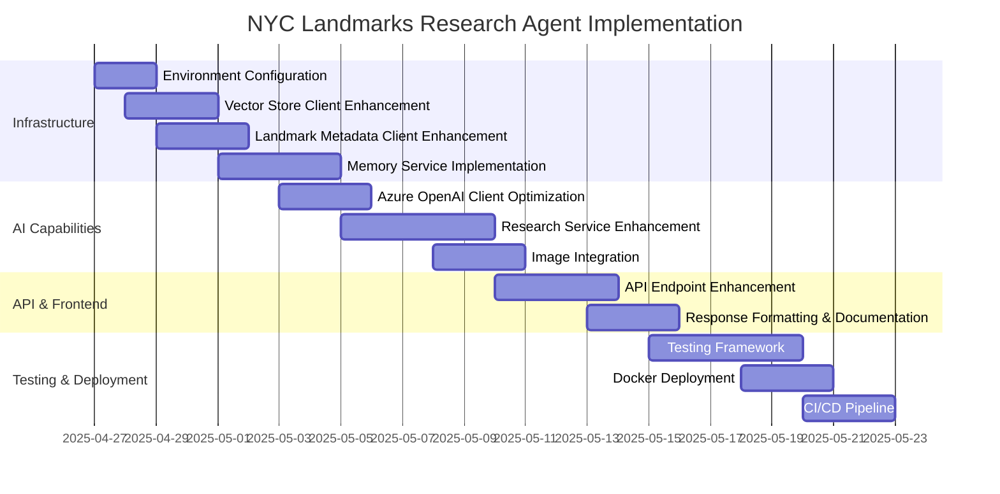

# NYC Landmarks Research Agent - Active Context

## Current Focus

The NYC Landmarks Research Agent is currently in the initial development phase. We've established the core architecture and scaffolding, but several key components need implementation and enhancement to achieve the full functionality described in the project brief.

Our immediate focus is on:

1. **Core API Integration Completion**: Finishing the implementation of the CoreDataStore API clients for both vector search and landmark metadata
2. **Memory Service Implementation**: Completing the conversation memory service for contextual follow-up questions
3. **Research Report Generation**: Enhancing the research report generation with better landmark detection and contextual understanding

## Recent Changes

- Set up the initial FastAPI application structure
- Created the basic service layer architecture
- Implemented the initial API endpoints for research generation
- Started implementing the vector store and landmark metadata clients
- Configured the project for Docker deployment

## Active Decisions & Considerations

### API Design Decisions
- Using FastAPI for its performance and automatic API documentation
- Implementing structured error responses with appropriate HTTP status codes
- Designing endpoints with clear separation of concerns

### Code Quality Automation
- Created a lint_fix.py script to automate pre-commit checks and auto-fix linting issues
- Added clear rules about requiring linting checks before task completion
- Integrated checks for docstrings, type annotations, and security issues
- Automated formatting with black and isort for consistent code style

### Data Flow Architecture
- Coordinating multiple external API calls through service layer
- Balancing between cached data and real-time API calls
- Structuring responses to include both research text and supporting metadata

### AI Integration Approach
- Using Azure OpenAI for research generation
- Defining prompt templates that encourage educational, well-structured responses
- Implementing context building with relevant passages and conversation history

### Memory Management
- Using in-memory storage for development with TTL
- Planning Redis integration for production
- Balancing memory retention with privacy considerations

## Next Steps

### 1. Complete Environment Configuration
- [ ] Finalize all required environment variables
- [ ] Create a comprehensive `.env.sample` file
- [ ] Document environment setup process

### 2. Vector Store Client Enhancement
- [ ] Implement advanced filtering options
- [ ] Add methods for batch document retrieval
- [ ] Improve error handling and retry logic

### 3. Landmark Metadata Client Enhancement
- [ ] Complete the `_convert_to_landmark_detail` method
- [ ] Implement proper response mapping
- [ ] Add methods for additional metadata retrieval

### 4. Memory Service Implementation
- [ ] Complete in-memory storage mechanism
- [ ] Implement proper TTL for conversations
- [ ] Design Redis integration for production

### 5. Research Service Enhancement
- [ ] Improve landmark extraction from text
- [ ] Enhance suggested queries generation
- [ ] Optimize research report formatting

### 6. Image Integration
- [ ] Implement robust photo retrieval
- [ ] Add caption generation for images
- [ ] Ensure proper historical vs. modern photo handling

### 7. Testing & Documentation
- [ ] Set up comprehensive test suite
- [ ] Create mock data for API testing
- [ ] Document all API endpoints and features

## Implementation Challenges

### Data Integration Challenges
- Converting API responses to our data models
- Handling incomplete or inconsistent landmark data
- Ensuring proper citation of sources

### AI Generation Challenges
- Crafting effective prompts for research generation
- Balancing detail with readability in reports
- Ensuring accurate information extraction and citation

### Performance Challenges
- Managing latency with multiple API dependencies
- Optimizing memory usage for conversation history
- Balancing response time with report quality

## Current Questions & Open Items

1. What are the performance characteristics of the CoreDataStore Vector API?
2. How should we handle rate limiting for Azure OpenAI?
3. What is the appropriate TTL for conversation memory?
4. How should we handle images with unclear copyright status?
5. What metrics should we track for report generation quality?
