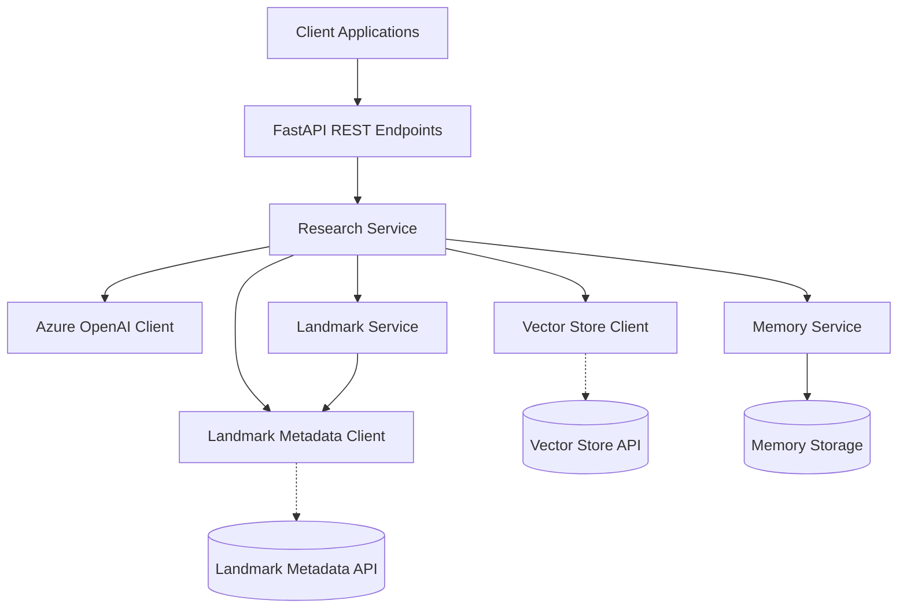

# NYC Landmarks Research Agent - System Patterns

## System Architecture

The NYC Landmarks Research Agent follows a layered architecture with clear separation of concerns:



## Key Design Patterns

### 1. Service Layer Pattern
The application uses service layers to encapsulate business logic and provide a clear API to the controllers:
- `ResearchService`: Core service for generating landmark research reports
- `LandmarkService`: Service for landmark-specific operations
- `MemoryService`: Service for managing conversation history

### 2. Repository Pattern
External data access is abstracted through client classes:
- `VectorStoreClient`: Interface to the CoreDataStore Vector API
- `LandmarkMetadataClient`: Interface to the CoreDataStore Landmark API
- `AzureOpenAIClient`: Interface to the Azure OpenAI Service

### 3. Dependency Injection
Services are injected via FastAPI's dependency injection system:
```python
def get_research_service():
    """Dependency to get a configured ResearchService instance."""
    vector_client = VectorStoreClient()
    landmark_client = LandmarkMetadataClient()
    memory_service = MemoryService()
    openai_client = AzureOpenAIClient()

    return ResearchService(
        vector_client=vector_client,
        landmark_client=landmark_client,
        memory_service=memory_service,
        openai_client=openai_client,
    )
```

### 4. Data Transfer Objects (DTOs)
Pydantic models are used for data validation and serialization:
- API request/response models in `api_models.py`
- Domain models in `landmark_models.py` and `research_models.py`

### 5. Strategy Pattern
The `ResearchService` implements different strategies for:
- Building research context
- Processing landmark information
- Generating research text
- Managing conversation history

### 6. Retry Pattern
External API calls use tenacity for retry logic:
```python
@retry(
    stop=stop_after_attempt(3),
    wait=wait_exponential(multiplier=1, min=2, max=10),
    retry=retry_if_exception_type((requests.RequestException, ConnectionError)),
    reraise=True,
)
```

## Component Relationships

### API Layer
- FastAPI routes defined in `src/endpoints/research.py`
- Main router in `src/api/router.py`
- Routes delegate to the service layer

### Service Layer
- `ResearchService`: Coordinates the generation of research reports
- `LandmarkService`: Handles landmark-specific operations
- `MemoryService`: Manages conversation context and history

### Client Layer
- `VectorStoreClient`: Performs semantic search on landmark text data
- `LandmarkMetadataClient`: Retrieves structured metadata about landmarks
- `AzureOpenAIClient`: Handles interactions with the OpenAI API

### Model Layer
- Pydantic models for request/response validation
- Domain models for internal data representation

## Data Flow

1. Client sends research query to API endpoint
2. API endpoint delegates to `ResearchService`
3. `ResearchService` coordinates:
   - Semantic search with `VectorStoreClient`
   - Metadata retrieval with `LandmarkMetadataClient`
   - Context building with conversation history from `MemoryService`
   - Research generation with `AzureOpenAIClient`
4. Results are formatted and returned to the client
5. Conversation history is updated in `MemoryService`

## Error Handling

- Structured exception handling with custom exceptions
- FastAPI HTTP exception mapping
- Retry logic for external API calls
- Comprehensive logging
